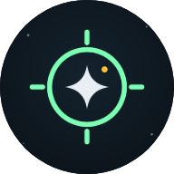
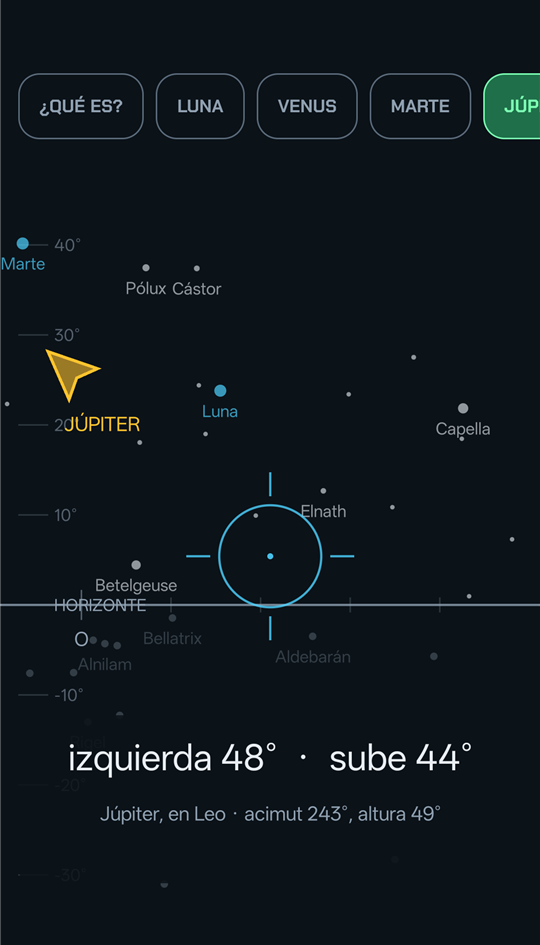
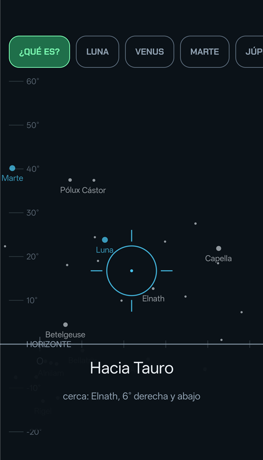
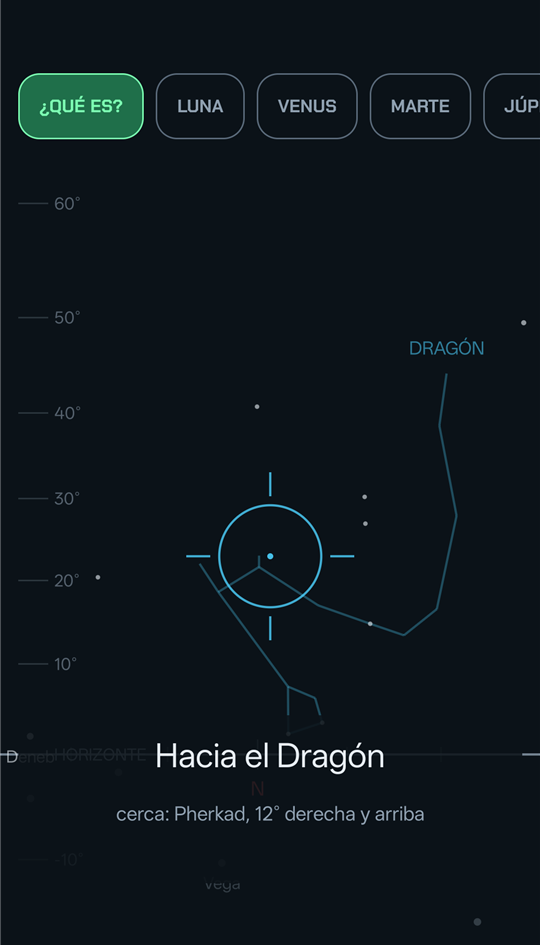
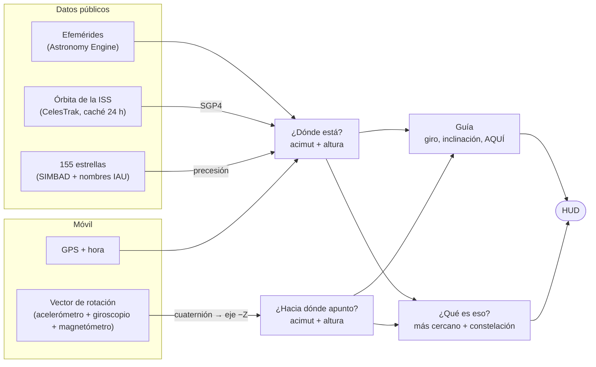

<p align="center">
  
</p>

<h1 align="center">CieloHud</h1>

<p align="center">
  <b>Una gincana mirando hacia arriba.</b><br/>
  Levantas el móvil, un HUD te guía hasta la Luna, un planeta o la Estación Espacial, y lo miras con tus propios ojos.
</p>

<p align="center">
  
  
  <a href="https://github.com/victorvalenciamunoz/CieloHud/actions/workflows/ci.yml"></a>
  
  
  <a href="LICENSE"></a>
</p>

---

## Qué es

CieloHud responde a dos preguntas, con el móvil en la mano y sin escribir nada:

- **«¿Dónde está?»** Eliges Saturno y la app te dice *«izquierda 48° · sube 44°»* hasta que la retícula se pone verde: **AQUÍ**. Bajas el móvil y ahí está.
- **«¿Qué es eso?»** Apuntas a un punto brillante y te dice *«BETELGEUSE · estrella · en Orión»*. Si no hay nada conocido, al menos te dice hacia qué constelación miras y qué tienes cerca.

Además calcula **cuándo pasa la ISS por encima de ti y si se va a ver**: iluminada por el Sol, con tu cielo ya oscuro y lo bastante alta.

<p align="center">
  
  &nbsp;
  
  &nbsp;
  
</p>
<p align="center"><sub>Modo guía hacia Júpiter · modo «¿qué es?» · figura de la constelación bajo la retícula. Horizonte, brújula, estrellas y figuras se mueven con el móvil.</sub></p>

### Principios

- **Cero entrada de datos.** La ubicación y la hora salen del móvil; las órbitas y efemérides son públicas.
- **Sin backend ni base de datos.** Todo se calcula en el dispositivo. Lo único que se descarga es la órbita de la ISS, una vez al día, y queda en caché.
- **El cielo es el juez.** Cada cálculo se ha contrastado con una fuente independiente (abajo, los números).
- **Pocos objetos que buscar, más cosas que reconocer.** No es un planetario: es una guía para encontrar lo que se ve desde una ciudad.

## Qué tiene ahora

| | |
|---|---|
| 🎯 **Guía** | Luna, Mercurio, Venus, Marte, Júpiter, Saturno e ISS. Flecha en el borde cuando está fuera de pantalla, marcador cuando está a la vista, **AQUÍ** con histéresis (entra a 4°, sale a 6°) para que no parpadee con el ruido de la brújula. |
| 🔭 **¿Qué es eso?** | Reconoce Luna, planetas, ISS y **155 estrellas** (todas las de magnitud < 3 visibles desde España, con su nombre IAU o su letra griega). Prefiere la más brillante cuando hay varias candidatas. Dice siempre en cuál de las **88 constelaciones** estás mirando. |
| 🧭 **Referencias** | Línea del horizonte con escala de altura, brújula con puntos cardinales, estrellas por brillo y planetas, todo moviéndose con el móvil. La **figura de la constelación** que tienes en la retícula, dibujada tenue con su nombre. Aviso cuando la brújula necesita calibración («dibuja un 8»). |
| 🛰️ **Pasos de la ISS** | Inicio, máximo y fin de cada paso visible en los próximos días, indicando si la ISS «aparece» saliendo de la sombra de la Tierra o «se apaga» a media travesía. |
| 💻 **Consola** | Tabla de posiciones para cualquier lugar e instante, y tabla de pasos de la ISS al estilo Heavens-Above. |

## El juez: cuánto acierta

Nada de esto vale si el objeto no está donde la app dice. Cada parte se ha validado contra una referencia externa:

| Qué | Contra qué | Resultado |
|---|---|---|
| Luna, planetas, Sol | [JPL Horizons](https://ssd.jpl.nasa.gov/horizons/) (NASA) | < 0,01° en acimut y altura |
| Luna, 3 instantes | [Stellarium Web](https://stellarium-web.org) | 0,003°–0,028° |
| Posición de la ISS (SGP4) | JPL Horizons | < 0,01°; distancia 567,41 km vs 567,35 km |
| 7 pasos de la ISS en un día | JPL Horizons | los 7, salidas y puestas a ±60 s |
| Pasos **visibles** de la ISS, 10 días | [Heavens-Above](https://www.heavens-above.com) | 10 de 10, máximo a ≤ 6 s y ≤ 1° |
| Constelación de planetas y Luna | JPL Horizons | 5 de 5 (sí: Saturno está en la Ballena, no en Piscis) |
| Brújula del móvil | Punto de referencia en tierra con acimut conocido | 2,6° de error tras calibrar |

El objetivo era 0,5° para planetas y 1° para la ISS; el cálculo va dos órdenes de magnitud por debajo. El límite real es el **magnetómetro del móvil** (unos 3–5°), y por eso la app guía a una zona, no a un píxel.

## Cómo funciona



Todo objeto, sea una estrella, un planeta o la ISS, acaba en el mismo sitio: **acimut** (0° norte, 90° este) y **altura** (0° horizonte, 90° cénit) desde tu posición y en este instante. Lo que cambia es de dónde sale:

- **Estrellas**: coordenadas fijas del catálogo (J2000) → precesión y nutación hasta hoy → rotación de la Tierra y tu latitud → refracción.
- **Luna y planetas**: efemérides que dan su posición de hoy vista desde tu punto de la Tierra → el mismo paso final.
- **ISS**: su órbita cambia cada día, así que se descarga la «foto» orbital (TLE) y se propaga con SGP4.

El móvil hace la pregunta inversa: el sensor de rotación da un cuaternión, que se convierte en la dirección hacia la que mira la cámara trasera, en el mismo sistema de acimut y altura. Todo se dibuja con una proyección gnomónica, la misma que forma la imagen en una cámara, así que el horizonte y las líneas de las constelaciones salen rectas incluso mirando cerca del cénit.

## Estructura

```
src/
  CieloHud.Core/        Librería de cálculo, sin UI ni dependencias de plataforma (la usan la consola y la app)
    Sky/                  Observador, posición horizontal, acimut, puntos cardinales
    SolarSystem/          Luna, planetas, Sol (Astronomy Engine)
    Satellites/           TLE, SGP4, sombra de la Tierra, proveedor CelesTrak con caché
    Passes/               Pasos de la ISS y cuáles son visibles
    Stars/                Catálogo de estrellas brillantes
    Constellations/       ¿En qué constelación cae esta dirección?
    Guidance/             Orientación del móvil, guía, proyección en pantalla, identificación
  CieloHud.Console/     Consola para validar cálculos (solo formatea lo que devuelve Core)
  CieloHud.App/         App .NET MAUI para Android: HUD, sensores, GPS
tests/
  CieloHud.Core.Tests/  253 tests xUnit, con referencias de JPL Horizons, Stellarium y Heavens-Above
docs/                   Visión, plan por fases, estado y decisiones (en español)
```

## Probarlo

**Requisitos:** SDK de .NET 10 (el `global.json` fija `10.0.401`). Para la app, además, el workload de MAUI para Android (`dotnet workload install maui-android`) y un móvil Android 8.0+ con depuración USB.

```bash
# Tests
dotnet test tests/CieloHud.Core.Tests

# ¿Dónde está cada cosa ahora? (Madrid por defecto)
dotnet run --project src/CieloHud.Console

# En otro lugar e instante
dotnet run --project src/CieloHud.Console -- --lat 41.3874 --lon 2.1686 --time 2026-10-03T04:00:00Z

# Pasos visibles de la ISS en los próximos 14 días
dotnet run --project src/CieloHud.Console -- --passes 14

# App en el móvil conectado por USB
dotnet build src/CieloHud.App -f net10.0-android -t:Install
```

<details>
<summary>Salida de ejemplo de la consola</summary>

```
Observador: lat 40.4168  lon -3.7038  alt 650 m
Instante:   2026-10-03 04:00:00 UTC  (2026-10-03 06:00:00 hora local, UTC+2)

Objeto      Acimut      Altura  Estado                Distancia
---------------------------------------------------------------
Luna       111.41° E    63.75°  sobre el horizonte   364 mil km
Mercurio    62.64° NE  -48.01°  bajo el horizonte    171.6 M km
Venus       67.14° NE  -54.72°  bajo el horizonte     50.3 M km
Marte       94.42° E    37.78°  sobre el horizonte   246.9 M km
Júpiter     87.90° E    21.72°  sobre el horizonte   882.0 M km
Saturno    248.45° O    26.22°  sobre el horizonte  1261.8 M km
ISS        161.15° S   -37.26°  bajo el horizonte       8364 km
```
</details>

## Hoja de ruta

- [x] **Fase 1** · Consola: dónde está cada cosa ahora, validado contra Horizons y Stellarium
- [x] **Fase 2** · Próximos pasos visibles de la ISS, validado contra Heavens-Above
- [ ] **Fase 3** · HUD en MAUI para Android: *hecho todo salvo la validación final bajo un cielo despejado*
- [ ] **Fase 4** · Avisos: «esta noche a las 21:43 pasa la ISS, 5 minutos, por el noroeste»
- [ ] **Fase 5** · IA como guía: qué estás viendo, explicado para no expertos

El detalle está en [`docs/`](docs): [visión](docs/VISION.md), [plan](docs/PLAN.md), [estado](docs/STATUS.md) y [decisiones](docs/DECISIONS.md). Ahí se explica, por ejemplo, por qué la altura del Sol se calcula sin refracción, o cómo se esquivó un bucle infinito de la librería de efemérides al apuntar al cénit.

## Créditos

CieloHud es hermano de [GincanaHud](https://github.com/victorvalenciamunoz/gincanaHud), del que hereda la estética del HUD.

Se apoya en:
- [Astronomy Engine](https://github.com/cosinekitty/astronomy) (Don Cross, MIT): efemérides, precesión y límites de constelaciones.
- [SGP.NET](https://github.com/parzivail/SGP.NET) (MIT): propagación orbital SGP4.
- [CelesTrak](https://celestrak.org): elementos orbitales de la ISS.
- [SIMBAD](https://simbad.cds.unistra.fr), CDS, Estrasburgo: coordenadas y magnitudes de las estrellas. *This research has made use of the SIMBAD database, operated at CDS, Strasbourg, France.*
- [IAU Catalog of Star Names](https://www.iau.org/public/themes/naming_stars/) (WGSN): nombres propios de las estrellas.
- [d3-celestial](https://github.com/ofrohn/d3-celestial) (Olaf Frohn, BSD): figuras de las constelaciones.
- Fuentes [Chakra Petch](https://github.com/m4rc1e/Chakra-Petch) y [Open Sans](https://github.com/googlefonts/opensans) (SIL OFL 1.1).

Las referencias de validación son [JPL Horizons](https://ssd.jpl.nasa.gov/horizons/), [Stellarium](https://stellarium.org) y [Heavens-Above](https://www.heavens-above.com). Las licencias de terceros están en [`THIRD-PARTY-NOTICES.md`](THIRD-PARTY-NOTICES.md).

## Licencia

El código de CieloHud se publica bajo la [licencia MIT](LICENSE): puedes usarlo, modificarlo y redistribuirlo libremente, manteniendo el aviso de copyright. Los componentes, datos y fuentes de terceros conservan sus propias licencias, recogidas en [`THIRD-PARTY-NOTICES.md`](THIRD-PARTY-NOTICES.md).
